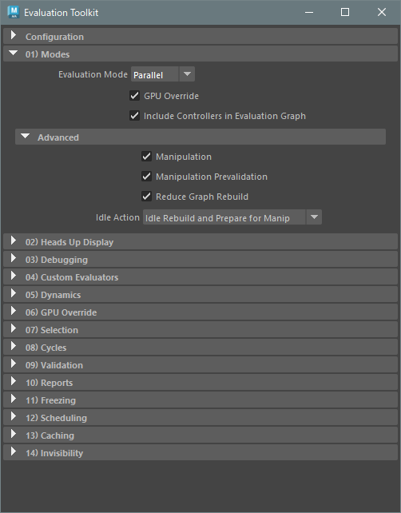

## Evaluation



### 01) Modes
```python
import maya.cmds as cmds
import maya.mel as mel
import maya.utils

# Evaluation Mode
cmds.evaluationManager(mode='parallel')
""" 
    mode (string):
        off      : DG
        serial   : serial
        parallel : parallel
"""

# GPU Override
#  On
mel.eval('turnOnOpenCLEvaluatorActive')
#  Off
mel.eval('turnOffOpenCLEvaluatorActive')

#  *If execute in usersetup.py
def turnOff_GPUOverride(*args):
	mel.eval('turnOffOpenCLEvaluatorActive')
maya.utils.executeDeferred(turnOff_GPUOverride)
```

## command references
* [evaluationManager](https://help.autodesk.com/cloudhelp/2023/ENU/Maya-Tech-Docs/CommandsPython/evaluationManager.html)