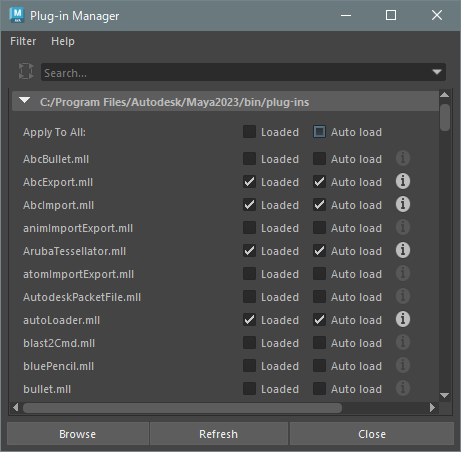

## Plug-in Manager



```python
# load
cmds.loadPlugin('fbxmaya.mll', qt=True)

# unload
cmds.unloadPlugin('fbxmaya.mll', f=True)
```

## command references
* [loadPlugin](https://help.autodesk.com/cloudhelp/2023/ENU/Maya-Tech-Docs/CommandsPython/loadPlugin.html)
* [unloadPlugin](https://help.autodesk.com/cloudhelp/2023/ENU/Maya-Tech-Docs/CommandsPython/unloadPlugin.html)