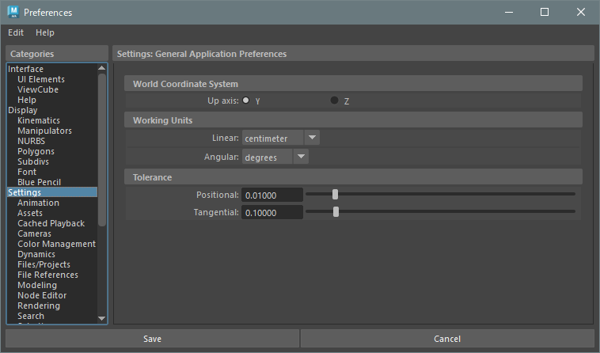

## Preferences > Settings



```python
# Working Units
cmds.currentUnit(l='cm', a='deg')
"""
    l (string): Linear
        'mm' 'cm' 'm' 'km' 'in' 'ft' 'yd' 'mi'

    a (string): Angular
        'deg' or 'rad'
"""
```

## command references
* [currentUnit](https://help.autodesk.com/cloudhelp/2019/ENU/Maya-Tech-Docs/CommandsPython/currentUnit.html)