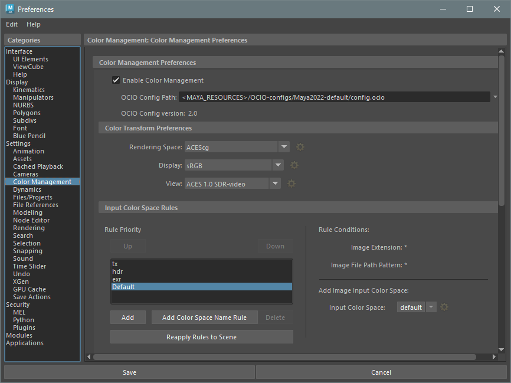
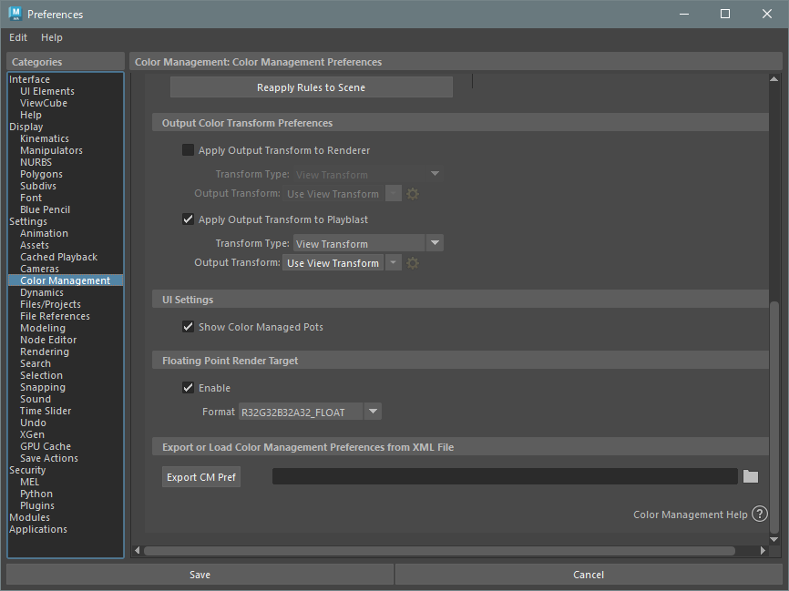

## Preferences > Settings > Color Management



### Color Management Preferences
#### Python commands
```python
"""
    Each argument cannot be edited at the same time
"""

# Enable Color Management
cmds.colorManagementPrefs(e=True, cme=True)

# OCIO Config Path
cmds.colorManagementPrefs(e=True, cfp='********.ocio')
```

#### Environment variables
```batchfile
:: OCIO Config Path
set OCIO=********.ocio
```

<!-- -->

## command references
* [colorManagementPrefs](https://help.autodesk.com/cloudhelp/2023/ENU/Maya-Tech-Docs/CommandsPython/colorManagementPrefs.html)
