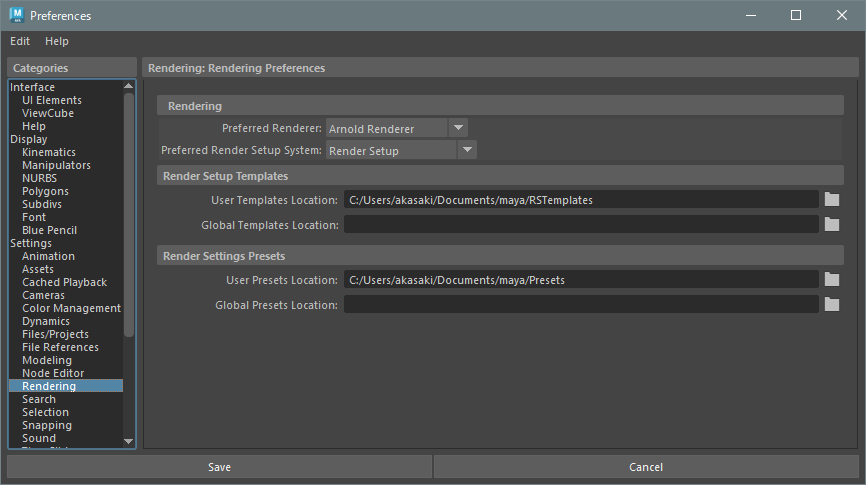

## Preferences > Settings > Rendering



### Rendering
#### Python commands
```python
# Preferred Renderer
cmds.preferredRenderer('arnold')
```

#### Environment variables
```batchfile
:: Preffered Render Setup System
set MAYA_ENABLE_LEGACY_RENDER_LAYERS=1

:: 0 : Render Setup
:: 1 : Legacy Render Layers
```

## command references
* [preferredRenderer](https://help.autodesk.com/cloudhelp/2023/ENU/Maya-Tech-Docs/CommandsPython/preferredRenderer.html)