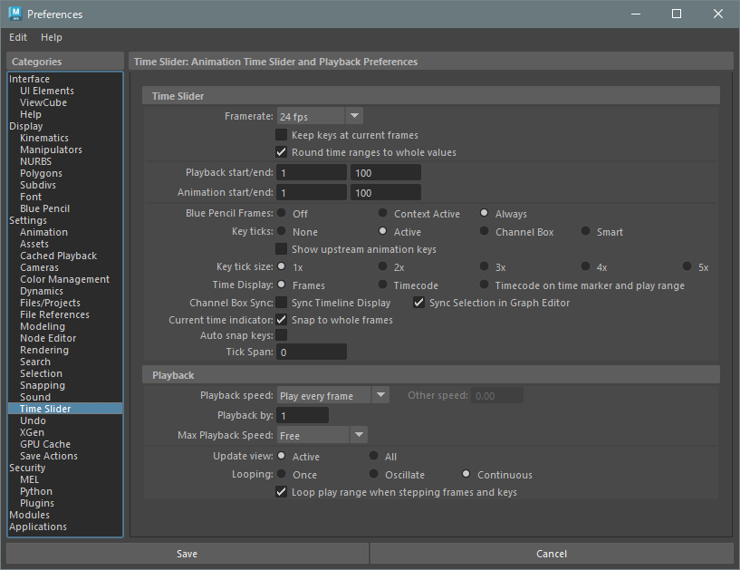

## Preferences > Settings > Time Slider



### Time Slider
```python
# Framerate
cmds.currentUnit(t='ntsc')
""" 
    t (string):
        game : 15 fps
        film : 24 fps
        pal  : 25 fps
        ntsc : 30 fps
        show : 48 fps
        palf : 50 fps
        ntscf: 60 fps
"""

# Playback start/end , Animation start/end
cmds.playbackOptions(min=1, max=100, ast=1, aet=100)

# current time
cmds.currentTime(1)
```

### Playback
```python
cmds.playbackOptions(ps=0, by=1, mps=0, v='Active')
"""
    ps (float): Playback speed
        0 : Play every frame

    by (float): Playback by
    
    mps (float): Max Playback Speed
        0 : Free
    
    v (string): Update view
        'Active' or 'All'
"""
```


## command references
* [currentUnit](https://help.autodesk.com/cloudhelp/2023/ENU/Maya-Tech-Docs/CommandsPython/currentUnit.html)
* [playbackOptions](https://help.autodesk.com/cloudhelp/2023/ENU/Maya-Tech-Docs/CommandsPython/playbackOptions.html)