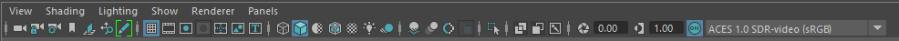

## View panel



```python
# get all viewport
mPanels = cmds.getPanel(type='modelPanel')
if mPanels:
    for mPanel in mPanels:
        # View

        # Shading
        #  Wireframe (same as 4 key)
        cmds.modelEditor(mPanel, e=True, da='wireframe')
        #  Smooth Shade All (same as 5 key)
        cmds.modelEditor(mPanel, e=True, da='smoothShaded')
        #  Smooth Shade All + Hardware Texturing (same as 6 key)
        cmds.modelEditor(mPanel, e=True, da='smoothShaded', dtx=True)

        # Lighting
        #  Use Default Lighting
        cmds.modelEditor(mPanel, e=True, dl='default')
        #  Use All Lights (same as 7 key)
        cmds.modelEditor(mPanel, e=True, dl='all')
        #  Shadows
        cmds.modelEditor(mPanel, e=True, sdw=True)

        # Show
        #  None
        cmds.modelEditor(mPanel, e=True, allObjects=False)
        #  Polygons
        cmds.modelEditor(mPanel, e=True, polymeshes=True)
        
        # Renderer
        #  Viewport 2.0
        cmds.modelEditor(mPanel, e=True, rnm='vp2Renderer')

        # Panel
        #  Change camera
        cmds.modelEditor(mPanel, e=True, camera='camera1')
```

## command references
* [modelEditor](https://help.autodesk.com/cloudhelp/2023/ENU/Maya-Tech-Docs/CommandsPython/modelEditor.html)
* [getPanel](https://help.autodesk.com/cloudhelp/2023/ENU/Maya-Tech-Docs/CommandsPython/getPanel.html)
