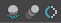

## Viewport (Hardware Renderer) 2.0 Settings


### Performance
```python
import maya.cmds as cmds

# Light Limit
cmds.setAttr('hardwareRenderingGlobals.maxHardwareLights', 8)

# Transparency Algorithm
cmds.setAttr('hardwareRenderingGlobals.transparencyAlgorithm', 5)
"""
    0 : Simple
    1 : Object Sorting
    2 : Weighted Average
    3 : Depth Peeling
    5 : Alpha Cut
    *) 4 is not valid.
"""

# Transparency Quality
cmds.setAttr('hardwareRenderingGlobals.transparencyQuality', .33)

# Transparency Shadows
cmds.setAttr('hardwareRenderingGlobals.transparentShadow', 1)

# Alpha Cut Prepass
cmds.setAttr('hardwareRenderingGlobals.alphaCutPrepass', 1)
```

### Maximum Texture Resolution Clamping
```python
# Clamp Texture Resolution
cmds.setAttr('hardwareRenderingGlobals.enableTextureMaxRes', 1)

# Max Texture Resolution
#  Mode
cmds.setAttr('hardwareRenderingGlobals.textureMaxResMode', 0)
"""
    0 : Automatic
    1 : Custom
"""
#  Resolution
cmds.setAttr('hardwareRenderingGlobals.textureMaxResolution', 2048)
```

### SSAO / Motion Blur / AA



```python
# Screen-space Ambient Occlusion
cmds.setAttr('hardwareRenderingGlobals.ssaoEnable', 1)

# Motion Blur
cmds.setAttr('hardwareRenderingGlobals.motionBlurEnable', 1)

# Multisample Anti-aliasing
cmds.setAttr('hardwareRenderingGlobals.multiSampleEnable', 1)
```

### (Others)
```python
# They are all hardwareRenderingGlobals attributes.
# To check other attributes, execute a following command.
cmds.listAttr('hardwareRenderingGlobals')
```